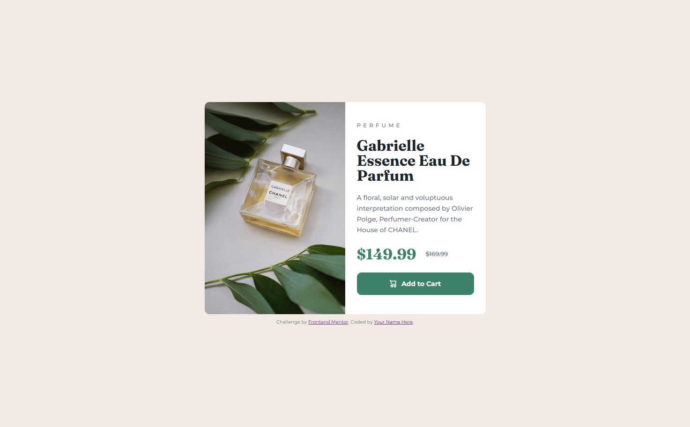

# Frontend Mentor - Product preview card component solution

This is a solution to the [Product preview card component challenge on Frontend Mentor](https://www.frontendmentor.io/challenges/product-preview-card-component-GO7UmttRfa). Frontend Mentor challenges help you improve your coding skills by building realistic projects.

## Table of contents

- [Overview](#overview)
  - [The challenge](#the-challenge)
  - [Screenshot](#screenshot)
  - [Links](#links)
- [My process](#my-process)
  - [Built with](#built-with)
  - [What I learned](#what-i-learned)

## Overview

### The challenge

Users should be able to:

- View the optimal layout depending on their device's screen size
- See hover and focus states for interactive elements

### Screenshot



### Links

- Solution URL: [github](https://github.com/nitinrs95/product-preview-card-component-main.git)
- Live Site URL: [Product Preview Card Component Page](https://nitinrs95.github.io/product-preview-card-component-main/)

## My process

### Built with

- Semantic HTML5 markup
- CSS custom properties
- Flexbox
- Sass
- Mobile-first workflow

### What I learned

- #### Sass

  I've gained a basic understanding of Sass and recognized its significance in improving CSS code organization.

- #### <picture> element
  I have successfully implemented art direction technique for responsive images by utilizing the <picture> element, enabling optimal image display across various devices and screen sizes.

```html
<picture class="card__image">
  <source
    srcset="/images/image-product-desktop.jpg"
    media="(min-width:39.375em)"
  />
  
</picture>
```
